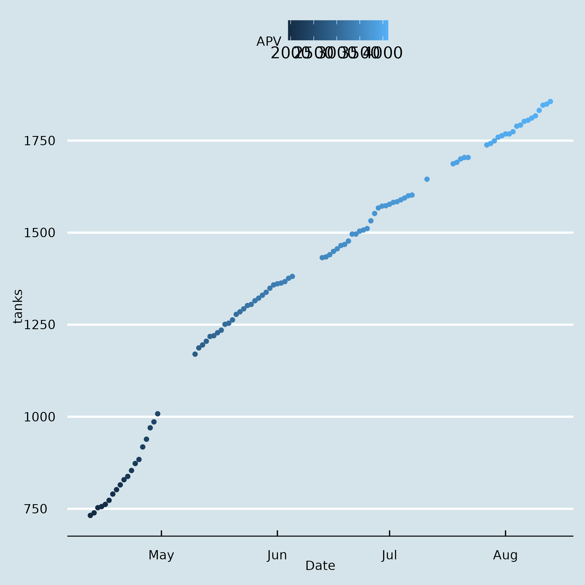

# Using Raku to scrape and analyze Ukraine Ministry of Defense Data

[](https://github.com/JJ/raku-ukr-mod-data/actions/workflows/test.yaml)
[](https://github.com/JJ/raku-ukr-mod-data/actions/workflows/python.yaml)
[](https://github.com/JJ/raku-ukr-mod-data/actions/workflows/parquet.yml)
[](https://github.com/JJ/raku-ukr-mod-data/actions/workflows/generate-new-CSV.yaml)
[](https://github.com/JJ/raku-ukr-mod-data/actions/workflows/test-upload-ghcr.yaml)

> This content also rendered at [the
> web](https://jj.github.io/raku-ukr-mod-data).

## Docker containers

Get the data locally:

```
docker run -p 31415:31415 ghcr.io/jj/ukr-mod-data:latest
```

and then

```
wget http://localhost:31415/ -o raw-data.csv
wget http://localhost:31415/deltas -o deltas.csv
```

You can also use

```shell
docker run --rm -t -v `pwd`:/home/raku/test  ghcr.io/jj/ukr-mod-data-csv
```

## Introduction



News about combat losses of the Russian invaders are periodically published
by the [Ukraininan minister of Defense](https://www.mil.gov.ua/en/news/)
This is a [Raku](https://raku.org) module that extracts information from
those pages, for instance [this one](https://www.mil.gov.ua/en/news/2022/06/05/the-total-combat-losses-of-the-enemy-from-24-02-to-05-06/).

> Note: English reports are updated less frequently than the [Ukrainian
> one](https://www.mil.gov.ua/news/2022/06/08/vid-pochatku-povnomasshtabnoi-vijni-proti-ukraini-rosiya-vtratila-uzhe-1393-tanki-znishheno-703-artilerijskih-sistemi-voroga-%E2%80%93-generalnij-shtab-zs-ukraini/),
> which are updated daily. That's left for future work.

## Installing

This repo uses Raku as well as Python for performing the whole downloading/scraping workflow. You will need a reasonably recent version of both to work. Additionally, install `poetry` globally.

When that's done, clone this repo or install via `zef` (when I upload it to the ecosystem
, shortly). If you want to run it directly from here, run

```shell
zef install --deps-only .
```

and

```shell
poetry install
```

If you just want to use the Raku part yourself, use `zef` for installation:

```shell
zef install Data::UkraineWar::MoD
```

## Running

You can always check the examples in the `t` directory. For convenience, an
[`Akefile`](Akefile) is also included. It contains several targets which automate some tasks

- `ake CSV`: generates CSV file in a fixed location
- `ake download`: invokes the python script to download data
- `ake prescrape`: check if there's some downloaded file that can't be scraped

## Reference

Not a lot of that, I'm afraid. There are two classes,
[`Data::UkraineWar::MoD::Daily`](lib/Data/UkraineWar/MoD/Daily.pm6), which
 will deal with content from a single webpage (updated daily-ish) and 
 [`Data::UkraineWar::MoD::Scrape`](lib/Data/UkraineWar/MoD/Scrape.pm6) which
  will look in a directory for all HTML pages and try to extract information
   from them, or bail out if some page does not contain losses information.
   
## Issues

 Please raise issues
 [at the repo](https://github.com/JJ/raku-ukr-mod-data/issues).

## See also

Failed tests for scraping are included in the `bin` directory. `scrapy.py` is
functional, you will need to install the corresponding Python and Chrome
dependencies.

- Download `chromedriver` from [here](https://chromedriver.chromium.org/downloads). You'll need to copy it by hand to
  the directory in the script, or anywhere else and change the script too
  . Please bear in mind that there are specific `chromedriver` binaries for
  every version of Chrome; they need to be exactly the same.

The raw content of the pages used as source is included in the [`raw-pages ` directory](raw-pages/), mainly for
caching purposes. They are (c) the Ministry of Defense of Ukraine, and the
source is [this page](https://www.mil.gov.ua/en/news/).

## License

This module is licensed under the Artistic 2.0 License (the same as Raku
itself). See [LICENSE](LICENSE) for terms.
